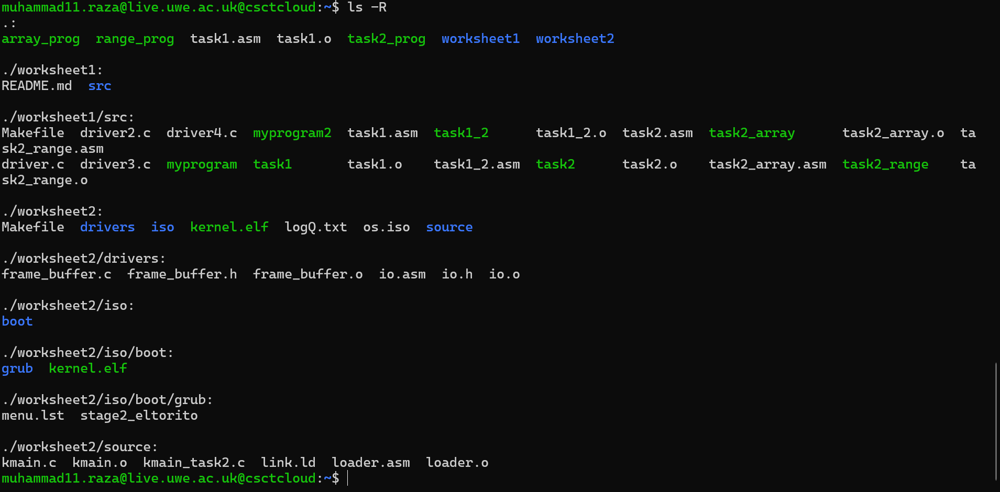
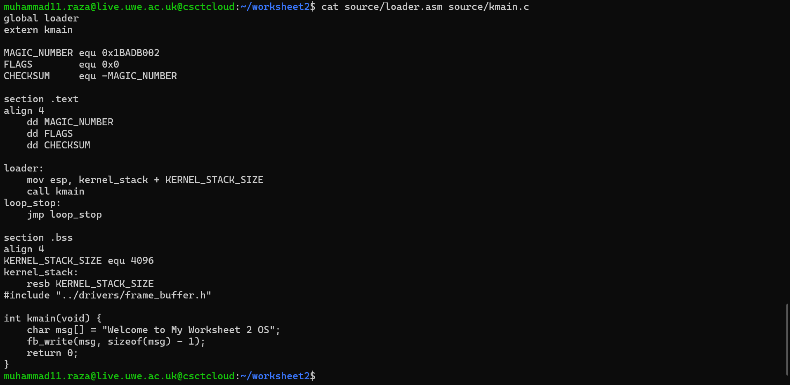
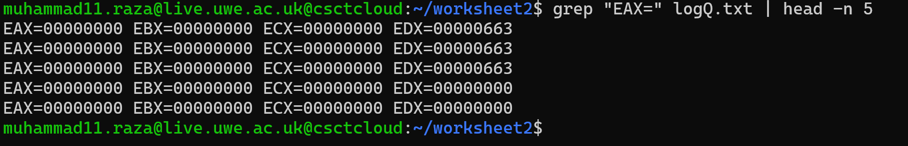
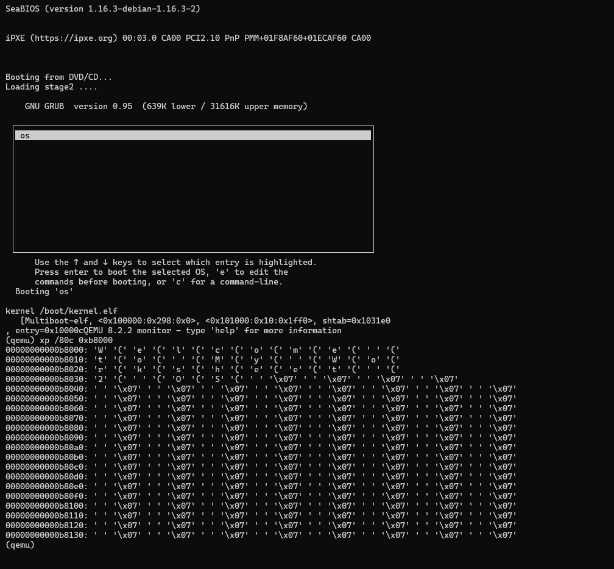

# Worksheet 2 Part 1: Starting a Tiny OS

This repository contains my complete submission for the first part of Worksheet 2. The objective was to build a minimal Operating System kernel from scratch, boot it using the GRUB bootloader, and implement basic drivers to communicate with hardware like the Framebuffer.

## 📂 Project Structure
I organized the project into `source`, `drivers`, and `iso` directories to keep the kernel logic and drivers separate.

**Directory Structure Screenshot:**


---

## 🛠 Implementation Details

### Task 1: Minimal OS Kernel
I started by writing `loader.asm` in Assembly. This file sets up the **Multiboot Magic Number** (`0x1BADB002`) so GRUB can recognize the kernel.
- **Goal:** To put the value `0xCAFEBABE` into the `EAX` register.
- **Bootloader:** I used `stage2_eltorito` to create the bootable ISO.

### Task 2: Linking C with Assembly
Since Assembly is hard to manage for complex logic, I extended the loader to set up a Stack and call a C function `kmain`.
- **C Kernel:** I implemented functions like `sum_of_three` in `kmain.c` to test the linking.
- **Verification:** The C function returns `57` (which is `0x39` in Hex).

**Source Code (Loader & Kernel):**


**Execution Proof (Log Check):**
Here you can see the registers `EAX=cafebabe` (Task 1) and `EAX=00000039` (Task 2) in the QEMU logs.


---

### Task 3: Framebuffer Driver (I/O)
This was the most significant task. I wrote a driver to display text on the screen by writing directly to the Video Memory at address `0x000B8000`.
- **I/O Ports:** I implemented `outb` in Assembly to control the cursor position via hardware ports.
- **Driver Logic:** I created `frame_buffer.c` to handle writing characters and setting colors (Green text on Dark Grey background).

**Driver Source Code:**


**Memory Dump Proof:**
Since QEMU was running in `-nographic` mode, I verified the output by inspecting the physical memory. The dump below clearly shows the text **"Welcome to My Tiny OS - Worksheet 2"** stored in memory.



---

## 🚀 How to Build & Run
I used a `Makefile` to automate the compilation of Assembly, C, and ISO creation.
 **Run these Commands:**
   ```bash
   make os.iso
   make run
   make clean
